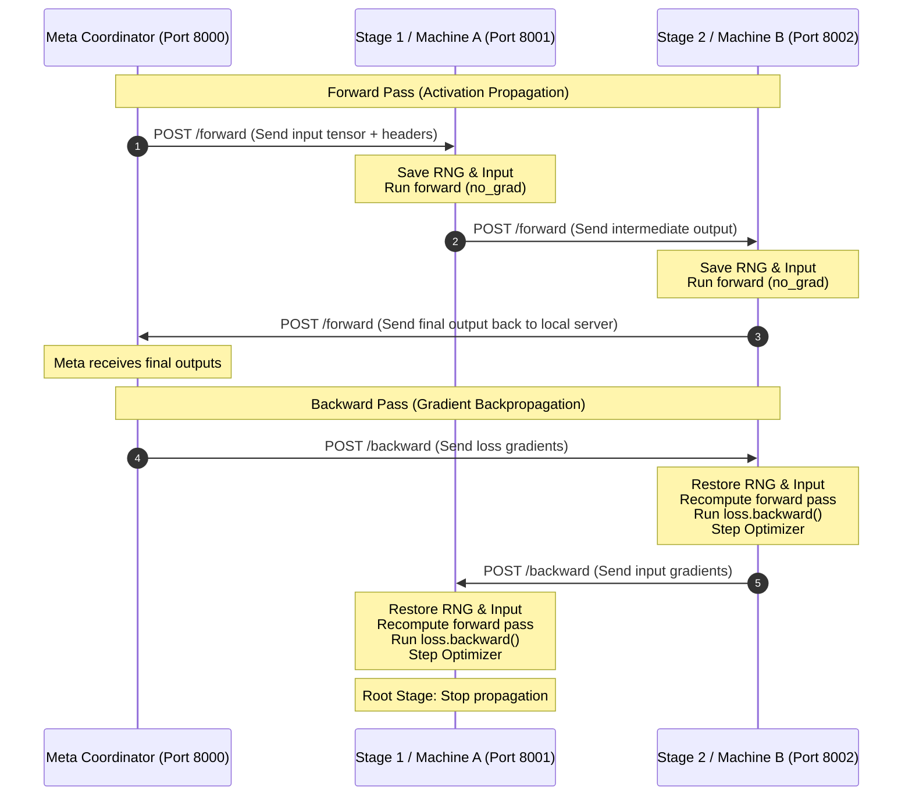

# 🚀 Distributed Pipeline Parallelism in PyTorch

A lightweight, HTTP-based pipeline parallel training framework designed to split and train large PyTorch models across multiple heterogeneous devices or machines easily. 

This toy project demonstrates the core concepts of **pipeline parallelism**, **activation (gradient) checkpointing**, and **asynchronous execution** using PyTorch, FastAPI, and standard HTTP protocols.

### ⚠️ Note

The Readme was AI-generated. (cause i hate writing by my own...)

---

## 📖 How It Works

Instead of training a model that is too large to fit on a single GPU/device, you split the model into sequential sub-modules (chunks). Each chunk runs on a different device (which can be on the same machine or different machines across a network) served by a FastAPI worker.



### 1. Daisy-Chained Forward Pass
1. The **`Meta` Coordinator** initiates a forward pass by sending the input batch to **Stage 1** (`Machine A`).
2. **Stage 1** processes the input tensor using `torch.no_grad()` to save memory, records its inputs and random number generator (RNG) states, and posts the intermediate output to **Stage 2** (`Machine B`).
3. This sequence continues until the final stage finishes, which posts the final output back to the `Meta` Coordinator's local listening server.

### 2. Gradient Checkpointing & Backward Pass
To avoid holding all intermediate activations in memory across the network during the forward pass (which would defeat the memory-saving purpose of pipeline parallelism):
1. Workers run the forward pass under `torch.no_grad()` and save only the **input tensor** and **RNG states** in an in-memory `batch_store`.
2. When the coordinator receives the final outputs, it computes the loss and propagates the gradients backward starting from the final stage.
3. Upon receiving the gradients, each worker:
   - Restores the exact forward-pass RNG states.
   - Recomputes the forward pass on the stored input (now with gradient tracking enabled).
   - Backpropagates using `result.backward(grad)`.
   - Performs an optimizer step (`self.optimizer.step()`).
   - Forwards the gradient with respect to the input tensor back to the previous stage.

---

## ✨ Features

- **🧩 Device/Machine Agnostic**: Easily split models across different local GPUs, CPU environments, or separate physical machines.
- **💾 Memory Efficient**: Implements custom activation recomputation/gradient checkpointing using RNG state restoration to keep GPU memory footprints minimal.
- **⚡ Asynchronous Concurrency**: The coordinator supports queueing up to multiple batches in parallel (`MAX_BATCH_QUEUE`), keeping pipeline stages hot and maximizing hardware utilization.
- **🛠️ Zero Configuration Overhead**: Relies on lightweight REST APIs (via FastAPI & `aiohttp`) for communication rather than complex NCCL/MPI configurations.

---

## 📂 Project Structure

```
├── src/
│   ├── meta.py            # Coordinator that triggers forward/backward pipelines
│   ├── model_wrapper.py   # Wraps PyTorch sub-models, handles recomputation and optimizer steps
│   ├── server.py          # FastAPI app serving model wrapper endpoints
│   ├── models.py          # Pydantic schemas for network serialization
│   └── async_utils.py     # Thread-safe async dicts and mutex locks
└── example-cnn/
    ├── machine_a.py       # First half of an MNIST CNN model
    ├── machine_b.py       # Second half of an MNIST CNN model
    └── meta.py            # Train loop coordinating both stages on MNIST dataset
```

---

## 🚀 Getting Started

### 1. Setup & Installation

This project uses [uv](https://github.com/astral-sh/uv) for fast, robust package and workspace management.

Clone the repository and install all dependencies (including workspace examples):
```bash
uv sync --all-packages
```

### 2. Running the MNIST CNN Example

This example trains a 2-stage CNN on MNIST. We will run two separate workers (stages) and then start the coordinator.

For demonstration, you can open three terminal windows:

#### Terminal 1: Run Stage 1 (Machine A - Port 8001)
```bash
uv run example-cnn/machine_a.py
```

#### Terminal 2: Run Stage 2 (Machine B - Port 8002)
```bash
uv run example-cnn/machine_b.py
```

#### Terminal 3: Run Coordinator (Meta - Port 8000)
```bash
uv run example-cnn/meta.py
```

Once the coordinator starts, it will download MNIST (if not already downloaded), spin up the pipeline, pipeline 48 batches concurrently, and train the model!

---

## 🛠️ API & Integration Guide

### Wrapping Your Own Model Stage
To deploy a layer or part of your model on a worker machine:

```python
import torch
import torch.nn as nn
import torch.optim as optim
from src.model_wrapper import ModelWrapper
from src.server import create_app
import uvicorn

# 1. Define model chunk
class ModelStage1(nn.Module):
    def __init__(self):
        super().__init__()
        self.layer = nn.Linear(100, 50)
    def forward(self, x):
        return torch.relu(self.layer(x))

device = torch.device("cuda" if torch.cuda.is_available() else "cpu")
model = ModelStage1().to(device)
optimizer = optim.Adam(model.parameters(), lr=1e-3)

# 2. Wrap model and optimizer
model_wrapper = ModelWrapper(model=model, optimizer=optimizer, device=device)

# 3. Serve via FastAPI
app = create_app(model_wrapper=model_wrapper)
uvicorn.run(app, host="0.0.0.0", port=8001)
```

### Coordinating the Pipeline
On your master/coordinator node, orchestrate the stages:

```python
import asyncio
import torch
from src.meta import Meta, HttpUrl

async def main():
    # 1. Define stages in execution order
    meta = Meta(
        device=torch.device("cpu"),
        servers=[
            HttpUrl("http://localhost:8001"),  # Stage 1
            HttpUrl("http://localhost:8002"),  # Stage 2
        ],
        host="127.0.0.1",
        port=8000,                             # Coordinator local receiver port
    )

    # 2. Run training inside the meta context
    async with meta.start():
        inputs = torch.randn(32, 100)
        targets = torch.randn(32, 10)
        criterion = torch.nn.MSELoss()

        # Forward Pass
        batch_key, outputs = await meta.forward(inputs)

        # Compute Loss
        loss = criterion(outputs, targets)
        loss.backward()

        # Backward Pass (propagates gradients back to workers & triggers weight updates)
        await meta.backward(batch_key, outputs.grad)
        
        print(f"Batch completed. Loss: {loss.item()}")

if __name__ == "__main__":
    asyncio.run(main())
```

---

## ⚠️ Notes, Limitations & Known Issues

- **HTTP Overhead**: This is a **toy project** designed for simplicity, ease of debugging, and cross-platform flexibility over heterogeneous networks. Standard HTTP protocol overhead makes it slower than dedicated high-performance frameworks (e.g., PyTorch RPC, NCCL/MPI-backed Pipeline Parallelism).
- **Network Serialization**: PyTorch Tensors are converted to CPU NumPy arrays and serialized to raw bytes for transport. Ensure your local networks have high bandwidth if passing large activation shapes.

### 🐛 Known Issues & Potential Bugs

1. **RNG State Mismatch on Multi-GPU Nodes**:
   - *The Issue*: `torch.cuda.get_rng_state()` defaults to the active device index (usually `cuda:0`). If you run workers on different GPUs (e.g. `cuda:0` and `cuda:1`) in a multi-GPU system without isolating visible devices, the wrong GPU's RNG state is captured and restored.
   - *The Impact*: Mismatched dropout/randomness masks between the forward pass and the recomputed forward pass in backpropagation.
   - *Future Fix*: Pass the target device explicitly to RNG functions if `self.device.type == "cuda"`:
     ```python
     cuda_rng = torch.cuda.get_rng_state(self.device)
     ```

2. **Eager CUDA Initialization on CPU Workers**:
   - *The Issue*: Checking `torch.cuda.is_available()` and calling `torch.cuda.get_rng_state()` on a machine with CUDA drivers will eagerly initialize CUDA even if the worker is explicitly configured to run on CPU.
   - *The Impact*: Crashes in environments with broken or restricted CUDA runtimes.
   - *Future Fix*: Guard all CUDA-related RNG logic with `self.device.type == "cuda"`.

3. **Fixed: Weight Mismatch during Pipelined Recomputation (In-flight Batches > 1)**:
   - *The Issue*: Currently, `self.optimizer.step()` is called immediately inside the worker's `backward()` pass. When running multiple batches in-flight concurrently (e.g. `MAX_BATCH_QUEUE > 1`):
     - **Batch 1** forward runs on Stage 1 using weights $W^{(0)}$.
     - **Batch 2** forward runs on Stage 1 using weights $W^{(0)}$ (since Batch 1 hasn't backpropagated yet).
     - **Batch 1** backward runs, recomputing forward on Stage 1 using $W^{(0)}$, and updates weights to $W^{(1)}$.
     - **Batch 2** backward runs, recomputing forward on Stage 1 using the updated weights $W^{(1)}$!
   - *The Impact*: Mismatch between original forward activations and backward recomputed activations for Batch 2, leading to incorrect gradients.
   - *Future Fix*: Decouple weight updates and gradient clearing from the `backward()` pass. Expose `/step` and `/zero-grad` HTTP endpoints on the workers to let the coordinator trigger parameter updates at the end of a full step (after all micro-batches have completed their backward passes).

